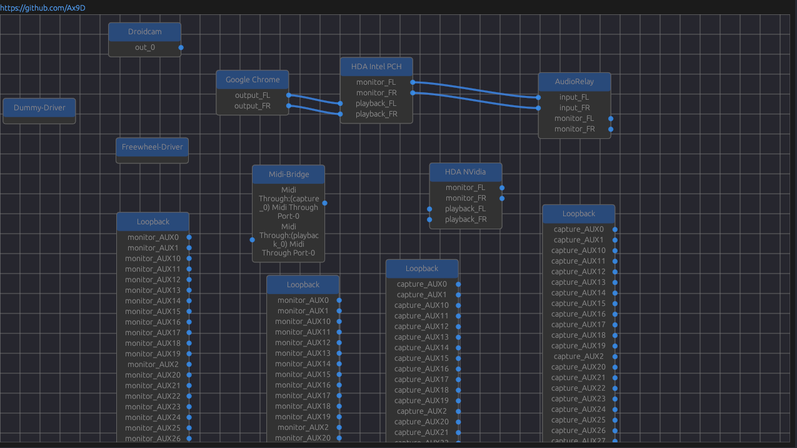

<div align="center">
    <h1>pw-viz</h1>
<h3> A simple and elegant, pipewire graph visualizer/patchbay. </h3>



</div>


This is still a WIP, the nodes aren't laid out based on their dependencies atm.

# Installation
Clone the repo:
```
git clone https://github.com/Ax9D/pw-viz
cd pw-viz
```
To build pw-viz, you will need to have Rust installed. The recommended way to install Rust is from the [official download page](https://www.rust-lang.org/tools/install), using rustup.

Once Rust is installed, you can build pw-viz: 

```cargo build --release```

Next you can copy the resulting binary(pw-viz) which will be found inside ```target/release``` to a directory in your ```$PATH```, like  ```/usr/bin/```

# Controls

 ||Description|
 |--- |---
 | Click + Drag | Move nodes, create links between ports |
 | <kbd>Alt</kbd>  + Left Click + Drag| Remove links |
 | Middle Mouse | Pan the graph |

Zooming is not currently supported


# Libraries Used
* [egui-rs](https://github.com/emilk/egui): an easy-to-use immediate mode GUI in pure Rust
* A modified fork of [egui-nodes](https://github.com/haighcam/egui_nodes): A egui port of [imnodes](https://github.com/Nelarius/imnodes)
* [pipewire-rs](https://gitlab.freedesktop.org/pipewire/pipewire-rs): Rust bindings for PipeWire

# Thanks / Alternatives
Pipewire connection code is inspired by helvum's implementation
[helvum](https://gitlab.freedesktop.org/ryuukyu/helvum): A GTK patchbay for pipewire.

# License
TODO
